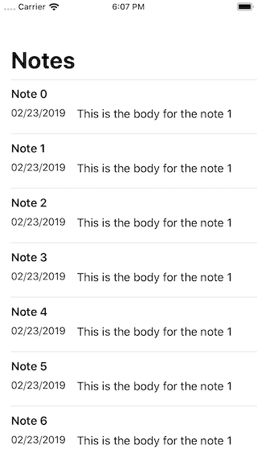
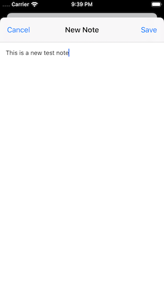
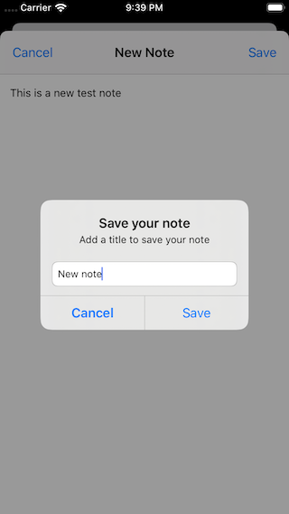
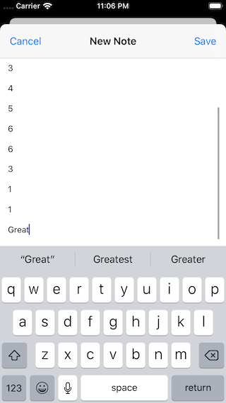
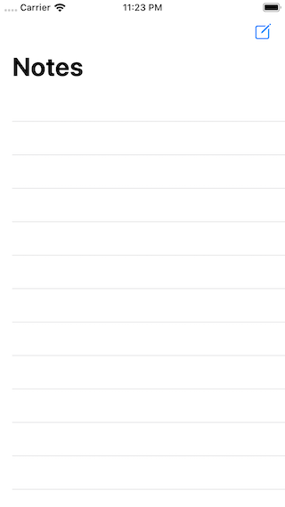
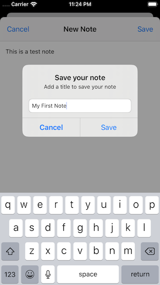
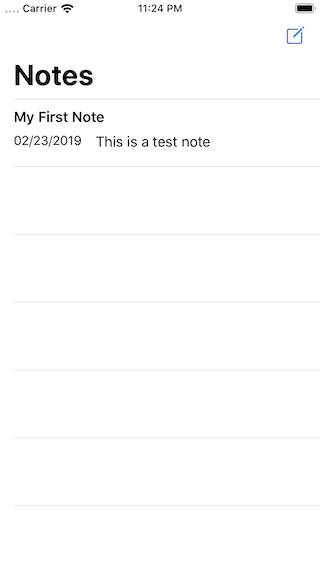

# Notto (Notes App Clone)

## Description
This basically is a simple clone of the most common and popular notes app that you may already know.

## Demo
### feature/notes-main-view-list
| Screenshot 01 |
| ------------- |
|  |

### feature/create-new-compose-view-controller
| Screenshot 02 | Screenshot 03 |
| ------------- |  ------------- |
|  |  |

### feature/handle-keyboard-notification
| Screenshot 04 |
| ------------- |
|  |

### feature/create-communication-between-newcompose-and-mainvc
| Screenshot 05 | Screenshot 06 | Screenshot 07 |
| ------------- |  ------------ |  ------------ |
|  |  |  |